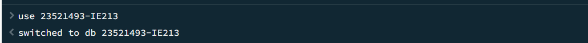
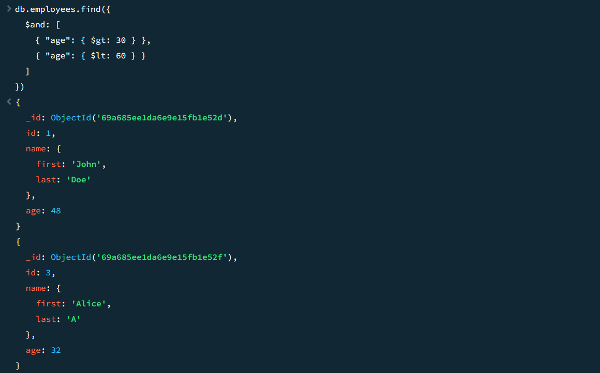
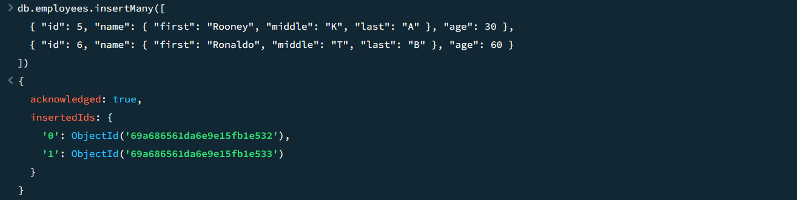
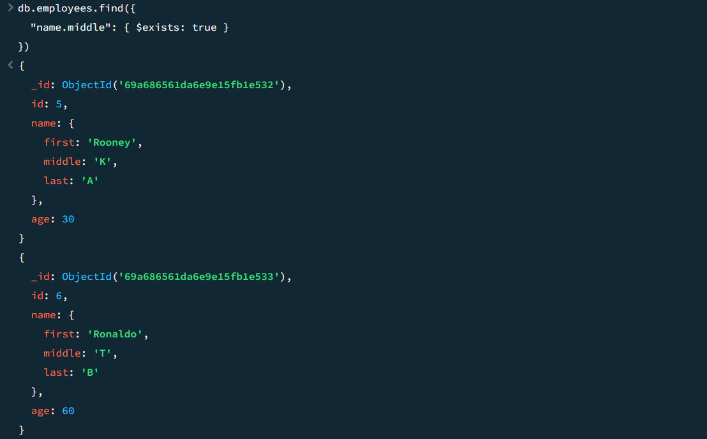
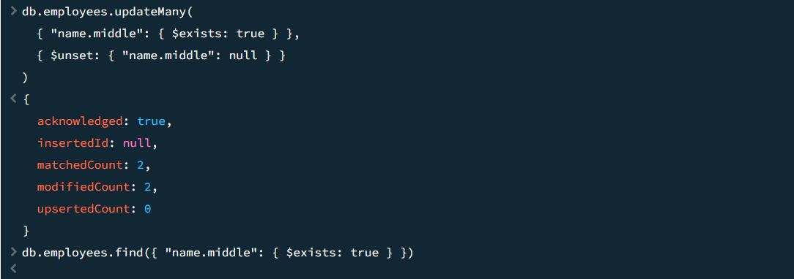
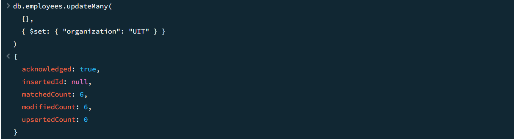
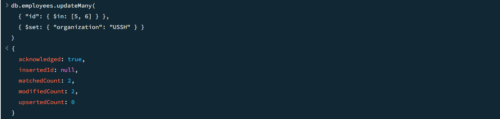
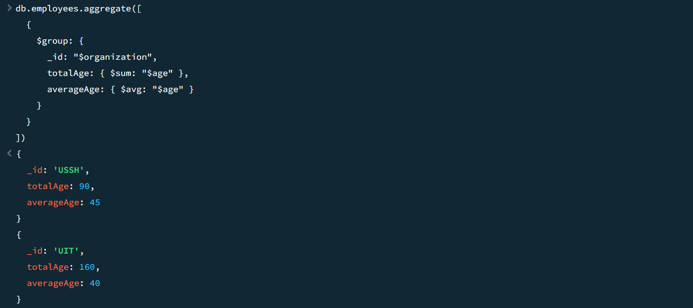

# Lab01

2.1 Tạo cơ sở dữ liệu có tên MSSV-IE213 trên cluster của bạn (trong đó MSSV là mã số sinh
viên của bạn).
use 23521493-IE213

2.2 Thêm các document sau đây vào collection có tên là employees trong db vừa được tạo ở
trên:
  {"id":1,"name":{"first":"John","last":"Doe"},"age":48}
  {"id":2,"name":{"first":"Jane","last":"Doe"},"age":16}
  {"id":3,"name":{"first":"Alice","last":"A"},"age":32}
  {"id":4,"name":{"first":"Bob","last":"B"},"age":64}

db.employees.insertMany([
  { "id": 1, "name": { "first": "John", "last": "Doe" }, "age": 48 },
  { "id": 2, "name": { "first": "Jane", "last": "Doe" }, "age": 16 },
  { "id": 3, "name": { "first": "Alice", "last": "A" }, "age": 32 },
  { "id": 4, "name": { "first": "Bob", "last": "B" }, "age": 64 }
])

2.3 Hãy biến trường id trong các document trên trở thành duy nhất. Có nghĩa là không thể thêm
một document mới với giá trị id đã tồn tại.

db.employees.createIndex({ "id": 1 }, { unique: true })

2.4 Hãy viết lệnh để tìm document có firstname là John và lastname là Doe.

db.employees.find({
  "name.first": "John",
  "name.last": "Doe"
})

2.5 Hãy viết lệnh để tìm những người có tuổi trên 30 và dưới 60.

db.employees.find({
  $and: [
    { "age": { $gt: 30 } },
    { "age": { $lt: 60 } }
  ]
})

2.6 Thêm các document sau đây vào collection:
{"id":5,"name":{"first":"Rooney", "middle":"K", "last":"A"},"age":30}
{"id":6,"name":{"first":"Ronaldo", "middle":"T", "last":"B"},"age":60}
Sau đó viết lệnh để tìm tất cả các document có middle name.

db.employees.insertMany([
  { "id": 5, "name": { "first": "Rooney", "middle": "K", "last": "A" }, "age": 30 },
  { "id": 6, "name": { "first": "Ronaldo", "middle": "T", "last": "B" }, "age": 60 }
])

db.employees.find({
  "name.middle": { $exists: true }
})

2.7 Cho rằng là những document nào đang có middle name là không đúng, hãy xoá middle
name ra khỏi các document đó.

db.employees.updateMany(
  { "name.middle": { $exists: true } },
  { $unset: { "name.middle": null } }
)

2.8 Hãy thêm trường dữ liệu organization: "UIT" vào tất cả các document trong employees
collection.

db.employees.updateMany(
  {},
  { $set: { "organization": "UIT" } }
)

2.9 Hãy điều chỉnh organization của nhân viên có id là 5 và 6 thành "USSH".

db.employees.updateMany(
  { "id": { $in: [5, 6] } },
  { $set: { "organization": "USSH" } }
)

2.10 Hãy viết lệnh để tính tổng tuổi và tuổi trung bình của nhân viên thuộc 2 organization là
UIT và USSH.

db.employees.aggregate([
  {
    $group: {
      _id: "$organization",
      totalAge: { $sum: "$age" },
      averageAge: { $avg: "$age" }
    }
  }
])

