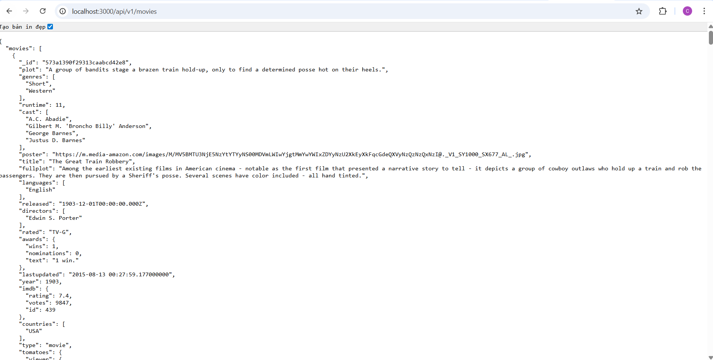
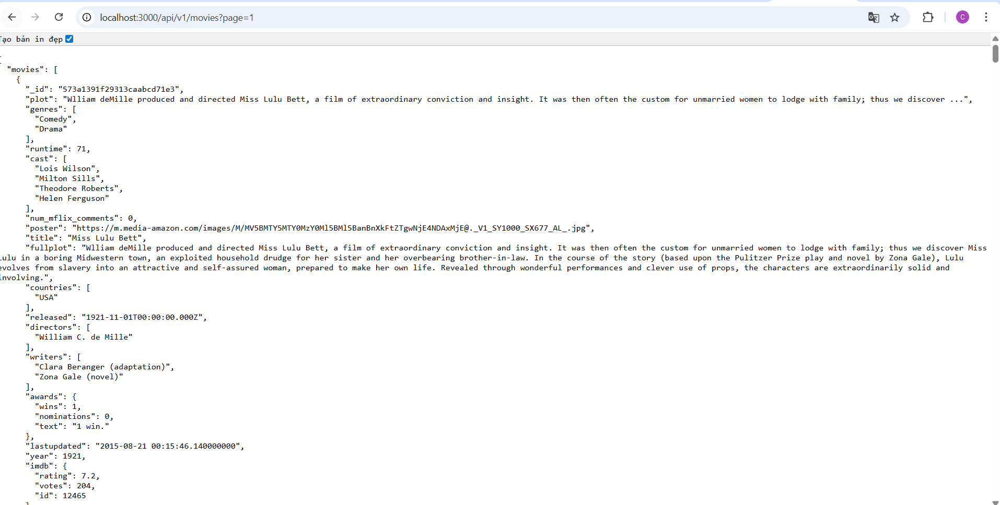
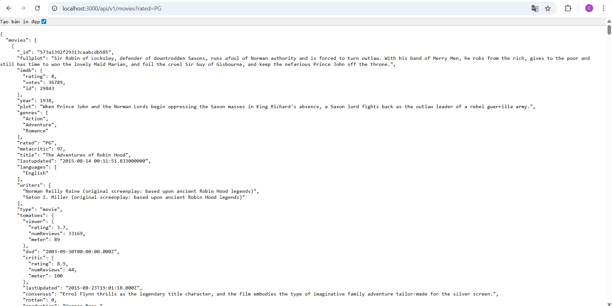
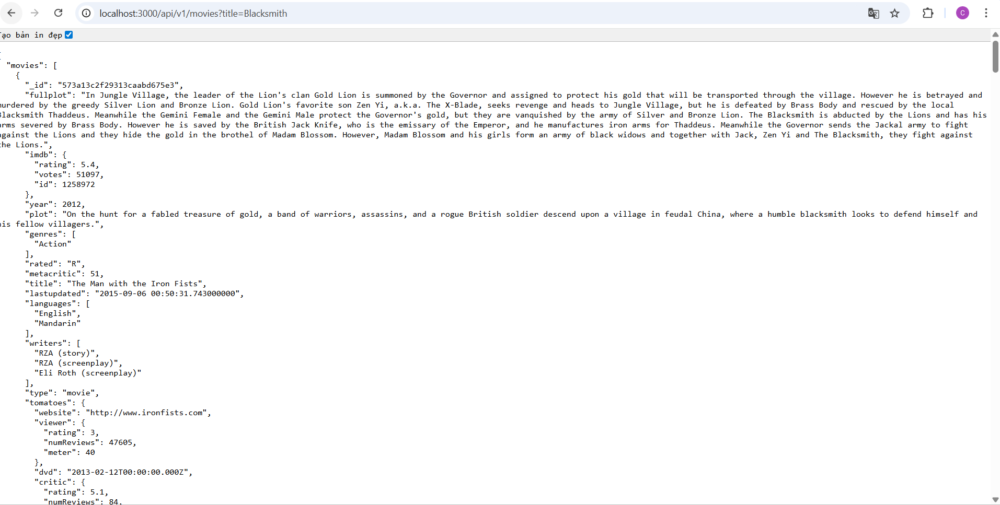
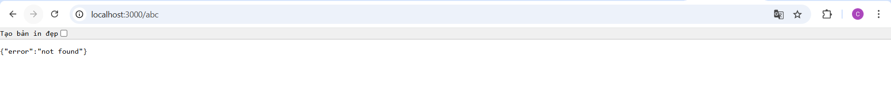

# Bài Thực Hành 2 – Thiết Lập Backend với Node/ExpressJS

> Môn: Kỹ Thuật Phát Triển Hệ Thống Web  
> Biên soạn: ThS. Võ Tấn Khoa

---

## Cấu trúc thư mục

```
backend/
├── api/
│   ├── movies.route.js
│   └── movies.controller.js
├── dao/
│   └── moviesDAO.js
├── server.js
├── index.js
├── .env
└── package.json
```

---

## Bài 1: Thiết lập môi trường

### 1.1 Cài đặt Node.js

```bash
node -v
npm -v
```

### 1.2 Cài đặt VS Code

Tải tại https://code.visualstudio.com

### 1.3 Tạo thư mục dự án

```bash
mkdir movie-reviews
cd movie-reviews
mkdir backend
cd backend
```

### 1.4 Khởi tạo dự án

```bash
npm init
```

### 1.5 Cài đặt dependency

```bash
npm install mongodb express cors dotenv
```

### 1.6 Cài đặt nodemon

```bash
npm install --save-dev nodemon
```

Cập nhật `package.json`:

```json
{
    "type": "module",
    "scripts": {
        "dev": "nodemon index.js"
    }
}
```

---

## Bài 2: Xây dựng Backend

### 2.1 `server.js`

```javascript
import express from 'express';
import cors from 'cors';
import movies from './api/movies.route.js';

const app = express();

app.use(cors());
app.use(express.json());

app.use('/api/v1/movies', movies);

app.use('*', (req, res) => {
    res.status(404).json({ error: 'not found' });
});

export default app;
```

---

### 2.2 `.env`

```env
MOVIEREVIEWS_DB_URI=mongodb+srv://<username>:<password>@cluster0.xxxxx.mongodb.net
MOVIEREVIEWS_NS=sample_mflix
PORT=3000
```

> **Lưu ý:** Lấy URI từ MongoDB Atlas → Cluster → Connect → Connect your application.  
> Data mẫu: vào Cluster → `...` → **Load Sample Dataset** để có database `sample_mflix`.

---

### 2.3 `index.js`

```javascript
import app from './server.js';
import mongodb from 'mongodb';
import dotenv from 'dotenv';
import MoviesDAO from './dao/moviesDAO.js';

async function main() {
    dotenv.config();

    const client = new mongodb.MongoClient(process.env.MOVIEREVIEWS_DB_URI);
    const port = process.env.PORT || 8000;

    try {
        await client.connect();
        await MoviesDAO.injectDB(client);

        app.listen(port, () => {
            console.log('Server đang chạy tại port: ' + port);
        });
    } catch (e) {
        console.error(e);
        process.exit(1);
    }
}

main().catch(console.error);
```

---

### 2.4 `api/movies.route.js` (ban đầu)

```javascript
import express from 'express';

const router = express.Router();

router.route('/').get((req, res) => res.send('hello world'));

export default router;
```

> Test: truy cập `localhost:3000/api/v1/movies` → thấy `hello world` là thành công.

---

### 2.5 `dao/moviesDAO.js`

```javascript
let movies;

export default class MoviesDAO {
    static async injectDB(conn) {
        if (movies) return;
        try {
            movies = await conn.db(process.env.MOVIEREVIEWS_NS).collection('movies');
        } catch (e) {
            console.error(`Không thể kết nối MoviesDAO: ${e}`);
        }
    }

    static async getMovies({ filters = null, page = 0, moviesPerPage = 20 } = {}) {
        let query;

        if (filters) {
            if ('title' in filters) {
                query = { $text: { $search: filters['title'] } };
            } else if ('rated' in filters) {
                query = { rated: { $eq: filters['rated'] } };
            }
        }

        let cursor;
        try {
            cursor = await movies
                .find(query)
                .limit(moviesPerPage)
                .skip(moviesPerPage * page);

            const moviesList = await cursor.toArray();
            const totalNumMovies = await movies.countDocuments(query);

            return { moviesList, totalNumMovies };
        } catch (e) {
            console.error(`Lỗi khi truy vấn: ${e}`);
            return { moviesList: [], totalNumMovies: 0 };
        }
    }
}
```

---

### 2.6 `api/movies.controller.js`

```javascript
import MoviesDAO from '../dao/moviesDAO.js';

export default class MoviesController {
    static async apiGetMovies(req, res, next) {
        const moviesPerPage = req.query.moviesPerPage ? parseInt(req.query.moviesPerPage) : 20;
        const page = req.query.page ? parseInt(req.query.page) : 0;

        let filters = {};
        if (req.query.rated) {
            filters.rated = req.query.rated;
        } else if (req.query.title) {
            filters.title = req.query.title;
        }

        const { moviesList, totalNumMovies } = await MoviesDAO.getMovies({
            filters,
            page,
            moviesPerPage,
        });

        let response = {
            movies: moviesList,
            page: page,
            filters: filters,
            entries_per_page: moviesPerPage,
            total_results: totalNumMovies,
        };

        res.json(response);
    }
}
```

---

### 2.7 `api/movies.route.js` (cập nhật dùng Controller)

```javascript
import express from 'express';
import MoviesController from './movies.controller.js';

const router = express.Router();

router.route('/').get(MoviesController.apiGetMovies);

export default router;
```

---

## Kiểm tra kết quả

Chạy server:

```bash
npm run dev
```

| URL                                             | Kết quả                 |
| ----------------------------------------------- | ----------------------- |
| `localhost:3000/api/v1/movies`                  | 20 phim đầu tiên        |
| `localhost:3000/api/v1/movies?page=1`           | Trang 2                 |
| `localhost:3000/api/v1/movies?rated=PG`         | Phim rated PG           |
| `localhost:3000/api/v1/movies?title=Blacksmith` | Tìm theo tên            |
| `localhost:3000/bất-kỳ-path-khác`               | `{"error":"not found"}` |

---

### Kết quả thực tế (theo ảnh test)

1. `localhost:3000/api/v1/movies`
    - Trả về JSON danh sách phim (trang mặc định).
    - Mẫu kết quả đầu tiên thấy trong ảnh: **"The Great Train Robbery"**.

2. `localhost:3000/api/v1/movies?page=1`
    - Trả về dữ liệu trang tiếp theo.
    - Mẫu kết quả đầu tiên thấy trong ảnh: **"Miss Lulu Bett"**.

3. `localhost:3000/api/v1/movies?rated=PG`
    - Trả về danh sách phim có `rated = "PG"`.
    - Mẫu kết quả đầu tiên thấy trong ảnh: **"The Adventures of Robin Hood"**.

4. `localhost:3000/api/v1/movies?title=Blacksmith`
    - Trả về danh sách phim theo bộ lọc `title` (text search).
    - Mẫu kết quả thấy trong ảnh: **"The Man with the Iron Fists"**.

5. `localhost:3000/abc`
    - Trả về lỗi 404 JSON:

```json
{ "error": "not found" }
```

> Ghi chú: Kết quả hiển thị đúng với logic route/controller/DAO đã cài đặt.

---

## Ảnh kết quả test URL

> Đặt ảnh vào thư mục `Lab02/images/` với đúng tên file bên dưới để Markdown hiển thị trực tiếp.

### 1) `GET /api/v1/movies`



### 2) `GET /api/v1/movies?page=1`



### 3) `GET /api/v1/movies?rated=PG`



### 4) `GET /api/v1/movies?title=Blacksmith`



### 5) `GET /abc` (404)



---

## Luồng hoạt động

```
Client Request
     ↓
movies.route.js        (định tuyến URL)
     ↓
movies.controller.js   (xử lý logic, đọc query params)
     ↓
moviesDAO.js           (truy vấn MongoDB)
     ↓
MongoDB Atlas          (trả dữ liệu từ sample_mflix)
     ↓
Response JSON → Client
```

---

## Nguồn dữ liệu

Data lấy từ **MongoDB Atlas Sample Dataset** – database `sample_mflix`, collection `movies`.  
Để load data: Cluster → `...` → **Load Sample Dataset** → chờ vài phút.
