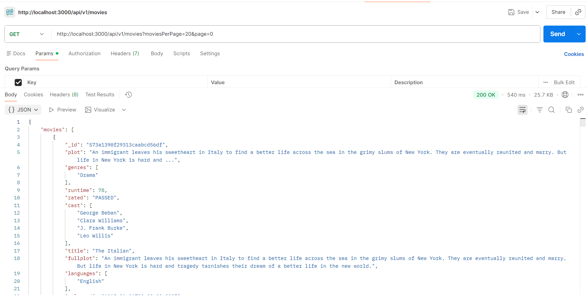
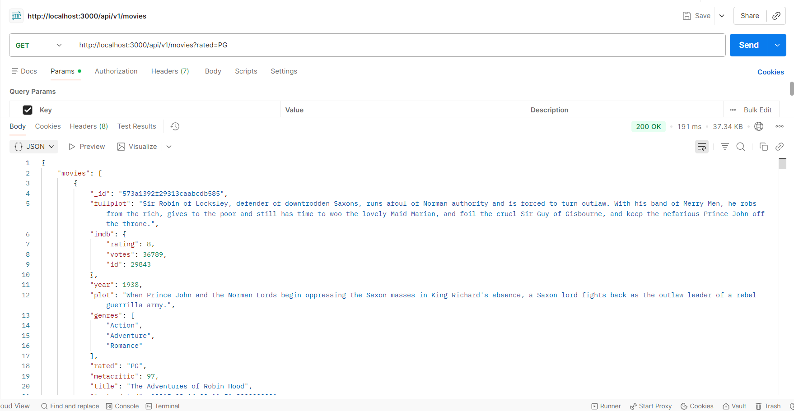
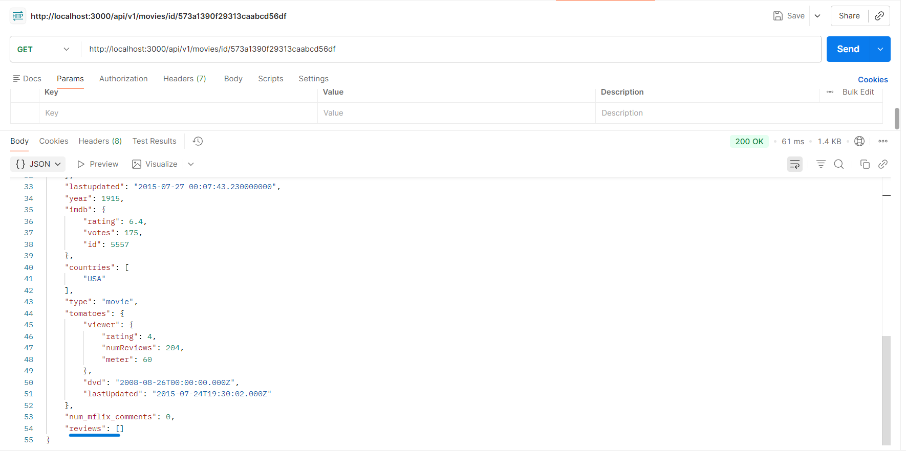
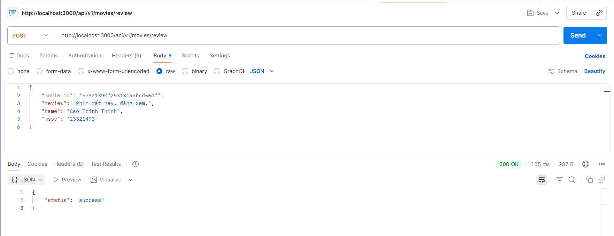
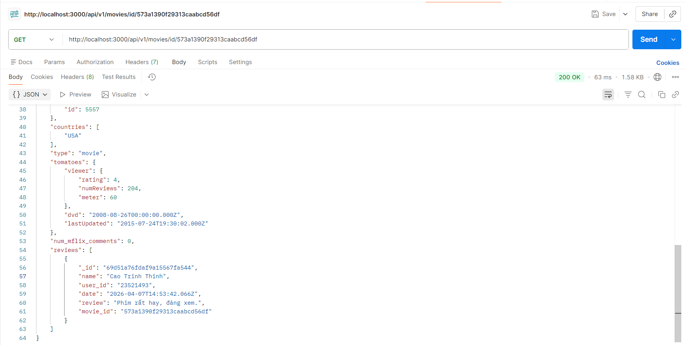
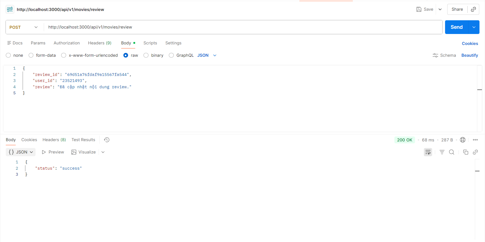
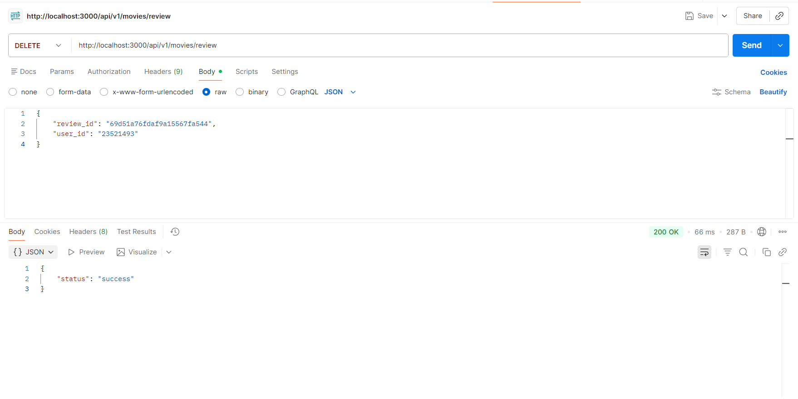
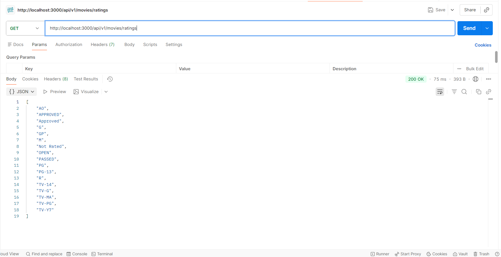

# Bài Thực Hành 3 – Hoàn Thiện Back-end Ứng Dụng Minh Hoạ

> Môn: Kỹ Thuật Phát Triển Hệ Thống Web  
> Nội dung: Reviews API + Movie Detail API + Ratings API

---

## 1) Cấu trúc thư mục Lab03

```text
Lab03/
├── Script.md
└── movie-reviews/
    └── backend/
        ├── api/
        │   ├── movies.route.js
        │   ├── movies.controller.js
        │   └── reviews.controller.js
        ├── dao/
        │   ├── moviesDAO.js
        │   └── reviewsDAO.js
        ├── .env
        ├── index.js
        ├── server.js
        └── package.json
```

---

## 2) Mục tiêu bài thực hành

- Thiết lập route cho Review:
    - `POST /api/v1/movies/review`
    - `PUT /api/v1/movies/review`
    - `DELETE /api/v1/movies/review`
- Thiết lập Controller + DAO cho Review (thêm/sửa/xoá).
- Bổ sung API phim:
    - `GET /api/v1/movies/id/:id` (lấy chi tiết phim + reviews liên quan)
    - `GET /api/v1/movies/ratings` (lấy danh sách tất cả loại rating)

---

## 3) Cấu hình môi trường

File `.env` trong `movie-reviews/backend`:

```env
MOVIEREVIEWS_DB_URI=
MOVIEREVIEWS_NS=
PORT=
```

---

## 4) Cài đặt và chạy server

Trong thư mục `Lab03/movie-reviews/backend`:

```bash
npm install
npm run dev
```

---

## 5) Các API đã hoàn thành

### 5.1 Lấy danh sách phim

- **GET** `/api/v1/movies`
- Hỗ trợ query:
    - `moviesPerPage`
    - `page`
    - `rated`
    - `title`

Ví dụ:

```text
http://localhost:3000/api/v1/movies?moviesPerPage=20&page=0
http://localhost:3000/api/v1/movies?rated=PG
http://localhost:3000/api/v1/movies?title=Blacksmith
```

---

### 5.2 Lấy tất cả rating

- **GET** `/api/v1/movies/ratings`

Ví dụ:

```text
http://localhost:3000/api/v1/movies/ratings
```

Kỳ vọng: trả về mảng như `[
  "APPROVED", "PASSED", "PG", "R", ...
]`

---

### 5.3 Lấy phim theo ID (kèm reviews)

- **GET** `/api/v1/movies/id/:id`

Ví dụ:

```text
http://localhost:3000/api/v1/movies/id/573a1390f29313caabcd56df
```

Kỳ vọng:

- Trả về thông tin phim.
- Có trường `reviews` là danh sách review liên quan (ghép bằng `$lookup`).

---

### 5.4 Thêm review

- **POST** `/api/v1/movies/review`
- Body JSON (theo yêu cầu MSSV):

```json
{
    "movie_id": "573a1390f29313caabcd56df",
    "review": "Phim rất hay, đáng xem.",
    "name": "Cao Trinh Thinh",
    "mssv": "23521493"
}
```

Kỳ vọng: `{"status":"success"}`

---

### 5.5 Sửa review

- **PUT** `/api/v1/movies/review`
- Body JSON:

```json
{
    "review_id": "69d51a76fdaf9a15567fa544",
    "user_id": "23521493",
    "review": "Đã cập nhật nội dung review."
}
```

Kỳ vọng: `{"status":"success"}`  
Lưu ý: phải đúng `user_id` đã tạo review thì mới sửa được.

---

### 5.6 Xoá review

- **DELETE** `/api/v1/movies/review`
- Body JSON:

```json
{
    "review_id": "69d51a76fdaf9a15567fa544",
    "user_id": "23521493"
}
```

Kỳ vọng: `{"status":"success"}`  
Lưu ý: phải đúng `user_id` đã tạo review thì mới xoá được.

---

## 6) Quy trình test đề xuất (Insomnia/Postman)

1. Gọi `GET /api/v1/movies?moviesPerPage=1&page=0` để lấy `movie_id` thật.
2. Gọi `POST /review` để thêm review mới với `mssv`.
3. Gọi `GET /id/:id` để tìm `review_id` vừa thêm.
4. Gọi `PUT /review` để sửa review bằng đúng `user_id`.
5. Gọi `DELETE /review` để xoá review bằng đúng `user_id`.
6. Gọi lại `GET /id/:id` để xác nhận review đã biến mất.

---

## 7) Mapping yêu cầu ↔ file mã nguồn

- Định tuyến reviews + id/ratings: `api/movies.route.js`
- Controller movies: `api/movies.controller.js`
- Controller reviews: `api/reviews.controller.js`
- DAO movies: `dao/moviesDAO.js`
- DAO reviews: `dao/reviewsDAO.js`
- Khởi tạo DB + inject DAO: `index.js`

---

## 8) Kết luận

Lab03 đã hoàn thiện phần back-end theo yêu cầu:

- CRUD review qua API.
- Lấy chi tiết phim kèm review liên quan.
- Lấy danh sách ratings.
- Hoạt động với MongoDB Atlas (`sample_mflix`) và định tuyến chuẩn `/api/v1/movies`.

---

## 9) Ảnh minh hoạ kết quả test API

### 9.1 GET `/api/v1/movies?moviesPerPage=20&page=0`



### 9.2 GET `/api/v1/movies?rated=PG`



### 9.3 GET `/api/v1/movies/id/:id` (trước khi thêm review)



### 9.4 POST `/api/v1/movies/review`



### 9.5 GET `/api/v1/movies/id/:id` (sau khi thêm review)



### 9.6 PUT `/api/v1/movies/review`



### 9.7 DELETE `/api/v1/movies/review`



### 9.8 GET `/api/v1/movies/ratings`


