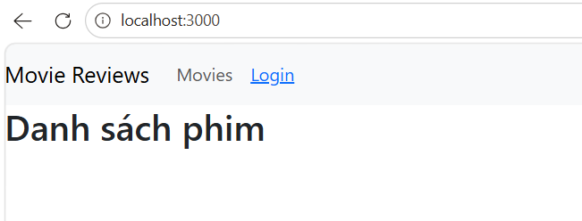
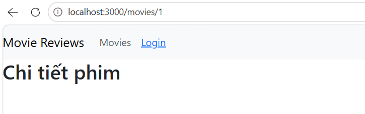
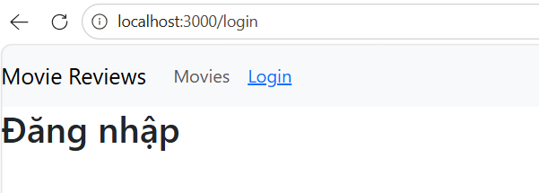
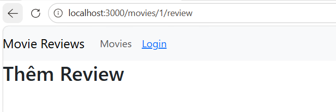

# Lab: Movie Review Frontend (React Router v6)

> **Môn:** Kỹ thuật Phát triển Hệ thống Web  
> **Stack:** React · React-Bootstrap · React Router DOM v6

---

## Bài 1: Thiết lập môi trường

### 1.1 Tạo project React

```bash
mkdir "Movie Review"
cd "Movie Review"
npx create-react-app frontend
cd frontend
npm start
```

**Kết quả:**

<!-- Ảnh: Trình duyệt mở localhost:3000 hiển thị logo React mặc định -->

---

### 1.2 Cài đặt packages

```bash
npm install bootstrap react-bootstrap react-router-dom@6
```

**Kết quả:**

<!-- Ảnh: Terminal hiển thị cài đặt thành công, package.json có các dependencies -->

---

## Bài 2: Xây dựng Navigation Bar

### 2.1 Tạo các component placeholder

Tạo thư mục `src/components/` và 4 file sau:

**`src/components/movies-list.js`**
```jsx
import React from "react";

function MoviesList() {
  return <div><h2>Danh sách phim</h2></div>;
}

export default MoviesList;
```

**`src/components/movie.js`**
```jsx
import React from "react";

function Movie(props) {
  return <div><h2>Chi tiết phim</h2></div>;
}

export default Movie;
```

**`src/components/add-review.js`**
```jsx
import React from "react";

function AddReview(props) {
  return <div><h2>Thêm Review</h2></div>;
}

export default AddReview;
```

**`src/components/login.js`**
```jsx
import React from "react";

function Login(props) {
  return <div><h2>Đăng nhập</h2></div>;
}

export default Login;
```

---

### 2.2 & 2.3 Cập nhật `src/index.js`

```jsx
import React from 'react';
import ReactDOM from 'react-dom/client';
import { BrowserRouter } from 'react-router-dom';
import App from './App';

const root = ReactDOM.createRoot(document.getElementById('root'));
root.render(
  <BrowserRouter>
    <App />
  </BrowserRouter>
);
```

---

### 2.2 & 2.3 Cập nhật `src/App.js`

```jsx
import React from "react";
import { Link, Routes, Route } from "react-router-dom";
import 'bootstrap/dist/css/bootstrap.min.css';
import Nav from 'react-bootstrap/Nav';
import Navbar from 'react-bootstrap/Navbar';

import AddReview from './components/add-review';
import MoviesList from './components/movies-list';
import Movie from './components/movie';
import Login from './components/login';

function App() {
  const [user, setUser] = React.useState(null);

  async function login(user = null) { setUser(user); }
  async function logout() { setUser(null); }

  return (
    <div className="App">
      <Navbar bg="light" expand="lg">
        <Navbar.Brand href="/">Movie Reviews</Navbar.Brand>
        <Navbar.Toggle aria-controls="basic-navbar-nav" />
        <Navbar.Collapse id="basic-navbar-nav">
          <Nav className="me-auto">
            <Nav.Link as={Link} to="/movies">Movies</Nav.Link>
            <Nav.Link>
              {user ? (
                <span onClick={logout} style={{ cursor: "pointer" }}>
                  Logout {user}
                </span>
              ) : (
                <Link to="/login">Login</Link>
              )}
            </Nav.Link>
          </Nav>
        </Navbar.Collapse>
      </Navbar>
    </div>
  );
}

export default App;
```

**Kết quả:**

<!-- Ảnh: Navbar hiển thị "Movie Reviews" | Movies | Login -->

---

## Bài 3: Thiết lập định tuyến

Thêm phần `<Routes>` vào `src/App.js` bên dưới `</Navbar>`:

```jsx
<Routes>
  <Route path="/"                  element={<MoviesList />} />
  <Route path="/movies"            element={<MoviesList />} />
  <Route path="/movies/:id"        element={<Movie user={user} />} />
  <Route path="/movies/:id/review" element={<AddReview user={user} />} />
  <Route path="/login"             element={<Login login={login} />} />
</Routes>
```

**`src/App.js` hoàn chỉnh:**

```jsx
import React from "react";
import { Link, Routes, Route } from "react-router-dom";
import 'bootstrap/dist/css/bootstrap.min.css';
import Nav from 'react-bootstrap/Nav';
import Navbar from 'react-bootstrap/Navbar';

import AddReview from './components/add-review';
import MoviesList from './components/movies-list';
import Movie from './components/movie';
import Login from './components/login';

function App() {
  const [user, setUser] = React.useState(null);

  async function login(user = null) { setUser(user); }
  async function logout() { setUser(null); }

  return (
    <div className="App">
      <Navbar bg="light" expand="lg">
        <Navbar.Brand href="/">Movie Reviews</Navbar.Brand>
        <Navbar.Toggle aria-controls="basic-navbar-nav" />
        <Navbar.Collapse id="basic-navbar-nav">
          <Nav className="me-auto">
            <Nav.Link as={Link} to="/movies">Movies</Nav.Link>
            <Nav.Link>
              {user ? (
                <span onClick={logout} style={{ cursor: "pointer" }}>
                  Logout {user}
                </span>
              ) : (
                <Link to="/login">Login</Link>
              )}
            </Nav.Link>
          </Nav>
        </Navbar.Collapse>
      </Navbar>

      <Routes>
        <Route path="/"                  element={<MoviesList />} />
        <Route path="/movies"            element={<MoviesList />} />
        <Route path="/movies/:id"        element={<Movie user={user} />} />
        <Route path="/movies/:id/review" element={<AddReview user={user} />} />
        <Route path="/login"             element={<Login login={login} />} />
      </Routes>
    </div>
  );
}

export default App;
```

**Kết quả — kiểm tra từng route:**

| URL | Hiển thị |
|-----|----------|
| `localhost:3000/` | Danh sách phim |
| `localhost:3000/movies` | Danh sách phim |
| `localhost:3000/movies/1` | Chi tiết phim |
| `localhost:3000/movies/1/review` | Thêm Review |
| `localhost:3000/login` | Đăng nhập |







